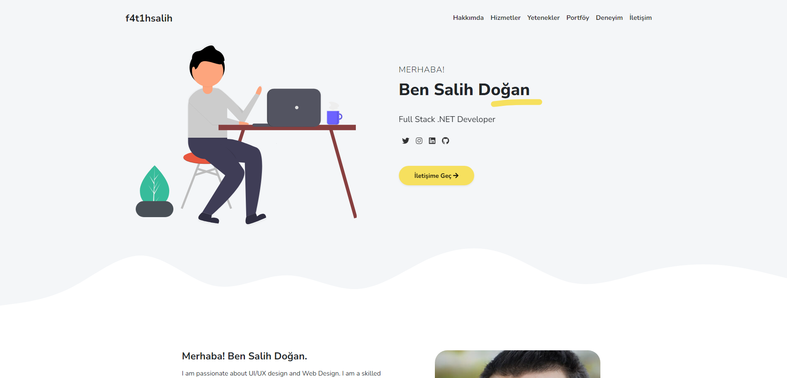
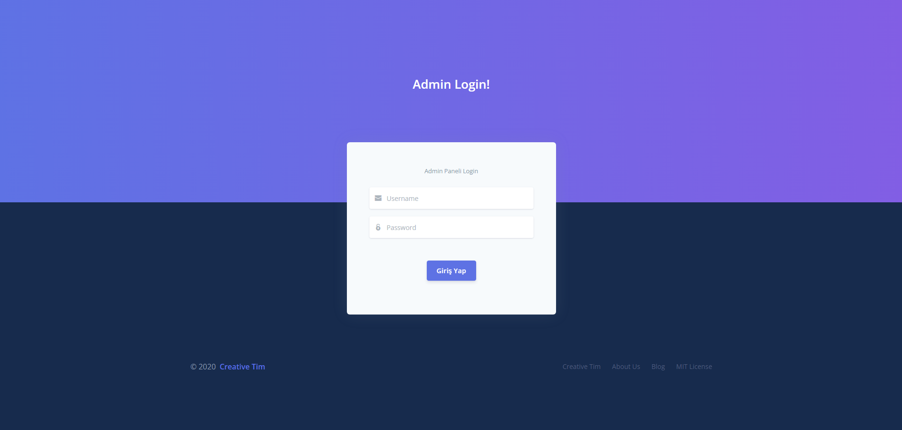
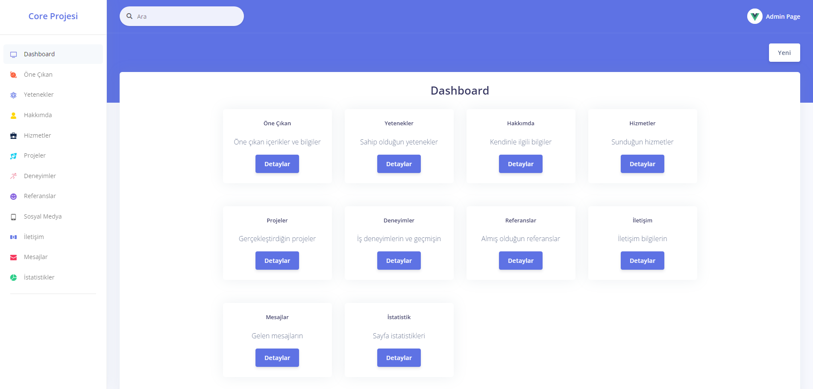
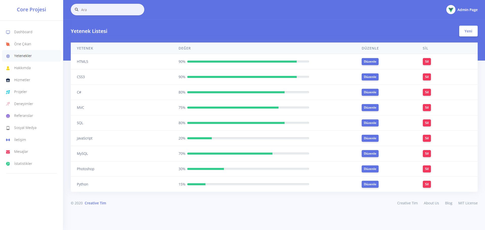
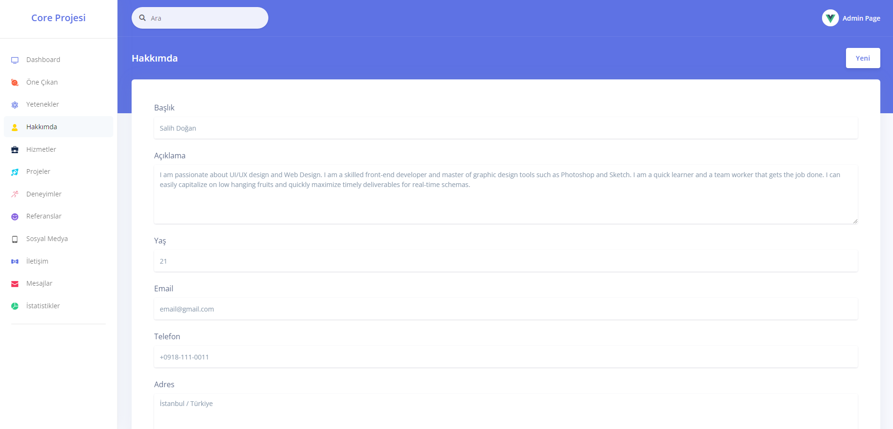
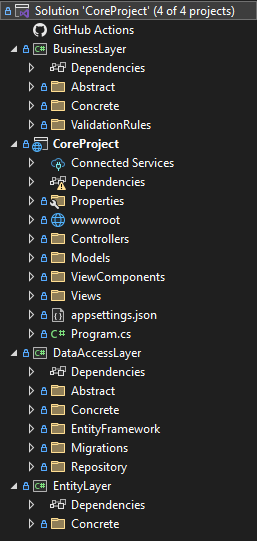

# 🌐 ASP.NET Core 8.0 ile Portföy ve Yönetim Paneli Projesi

Bu proje, **ASP.NET Core 8.0** kullanılarak **n katmanlı mimari** ile geliştirilmiş, iki ana bölümden oluşan bir web uygulamasıdır. **Portföy** sayfası ziyaretçilerin bilgi alabileceği ve mesaj gönderebileceği bir arayüz sunarken, **Admin Paneli** site yöneticisinin portföydeki bilgileri güncellemesine olanak tanır.

## 📌 Proje Hakkında

Bu proje, bir portföy web sitesi ve yönetim paneli olarak tasarlanmıştır. Ziyaretçiler ana sayfa üzerindeki içeriklere göz atabilir ve mesaj bırakabilirken, admin paneli yalnızca yönetici tarafından erişilebilir ve ana sayfadaki içeriklerin güncellenmesi amacıyla kullanılmaktadır.

## 🎯 Özellikler

### Portföy Sitesi
- **Genel Bilgi**: Ziyaretçilerin görebileceği bilgiler ve projeler hakkında detaylar.
- **Mesaj Gönderme**: Ziyaretçilerin doğrudan sayfa üzerinden mesaj iletebilmesi.

### Admin Paneli
- **İçerik Güncelleme**: Ana sayfadaki portföy bilgilerini güncelleme.
- **Basit Yönetim İşlevleri**: Yalnızca portföy bilgilerini değiştirmeye yönelik minimal bir yönetim paneli.

## 🛠️ Kullanılan Teknolojiler

- **ASP.NET Core 8.0**: Projenin temel framework'ü.
- **Entity Framework Core**: Veritabanı işlemleri için kullanılan ORM.
- **Bootstrap**: Kullanıcı arayüzü tasarımı.
- **Fluent Validation**: Form doğrulama işlemleri.
- **LINQ**: Veritabanı sorguları için.
- **N Katmanlı Mimari**: Katmanlar arası bağımsızlığı sağlayan mimari yapı.

## 📂 Proje Yapısı

- **Controllers**: Kullanıcı ve admin işlemlerini yöneten sınıflar.
- **Models**: Veritabanı tablolarını ve veri yapılarını içerir.
- **Views**: Kullanıcı ve admin için farklı Razor görünümleri.
- **wwwroot**: CSS, JavaScript ve görseller gibi statik dosyaları içerir.

## ⚙️ Kurulum

1. Projeyi klonlayın:
   ```bash
   git clone https://github.com/f4t1hsalih/CoreProject.git

## Proje Resimleri
Aşağıda projeye ait bazı ekran görüntüleri bulunmaktadır:







